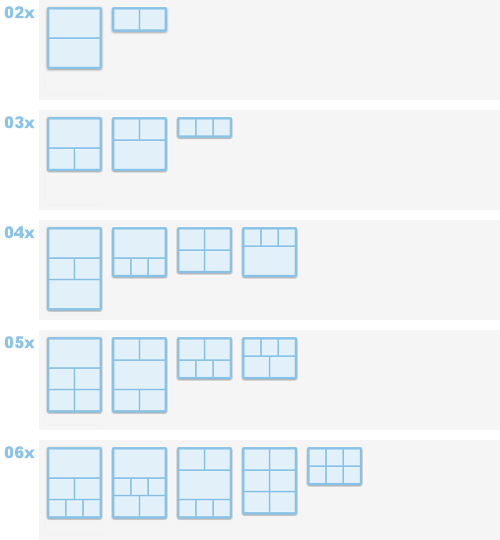
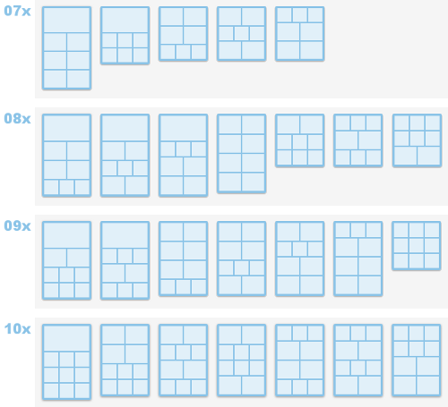

虽然 `Markdown` 语法已经非常丰富能够满足我们写文章的绝大部分需求，但是为更好的对文章内容进行更友好的排版，为引设计一套自定义的短语，便于在使用时能够快速引用。

<!--more-->

## 块引用

在引用一些经典名言名句时，可以采用此短语，语法参考如下：

```markdown

  ### block quote
  写下你想表达的话语！

```

实际效果：



希望是无所谓有，无所谓无的，这正如地上的路。


其实地上本没有路，走的人多了，也便成了路。

**鲁迅**



## 信息块

支持 `default`，`info`，`success`，`warning`，`danger` 等五种不同效果的展示，语法参考如下：

```markdown

  书写表达的信息
  支持 Markdown 语法

```

实际效果：


  ### Default Header without icon
  **Welcome** to [Hugo NexT!](https://preview.hugo-next.eu.org)



  ### Default Header
  **Welcome** to [Hugo NexT!](https://preview.hugo-next.eu.org)



  ### Primary Header
  **Welcome** to [Hugo NexT!](https://preview.hugo-next.eu.org)



  ### Info Header
  **Welcome** to [Hugo NexT!](https://preview.hugo-next.eu.org)



  ### Success Header
  **Welcome** to [Hugo NexT!](https://preview.hugo-next.eu.org)



  ### Warning Header
  **Welcome** to [Hugo NexT!](https://preview.hugo-next.eu.org)



  ### Danger Header
  **Welcome** to [Hugo NexT!](https://preview.hugo-next.eu.org)



## Bilibili 视频

```markdown

或者

```


## 音乐播放器

基于[APlayer](https://github.com/DIYgod/APlayer)和[MetingJS](https://github.com/metowolf/MetingJS)库实现见面内嵌的响应式音乐播放器，自动识别的音乐平台URL，包括：`netease`、 `tencent`、 `kugou`、 `baidu` 和 `xiami` 平台，也可以支持用户自定义的音乐源。其他相关的参数说明如下：

| 参数名  | 默认   | 说明  |
| :----: | :------: | :--- |
| **id** | _必选_  | 音乐 ID，即音乐在音乐平台的唯一标识符 |
| **server** | _必选_  | 音乐平台，支持 `netease`、 `tencent`、 `kugou`、 `baidu` 和 `xiami` 平台 |
| **type** | _必选_  | 播放类型，目前支持 `song` 、 `playlist`、 `album`、 `search` 和 `artist` 类型 |
| **auto** | _可选_  | 音乐的地址，仅支持 server 参数中的平台 |
| **theme** | `#448aff`  | 播放器的主题色，默认为 `#448aff` |
| **url** | 空  | 自定的音乐源 URL，默认为空 |
| **name** | 空 | 音乐名称，默认为空 |
| **artist** | 空  | 音乐作者，默认为空 |
| **cover** | 空  | 音乐封面 URL，默认为空 |
| **fixed** | `false` | 固定播放器，默认为 `false` |
| **mini** | `false`  | 显示小播放器，默认为 `false` |
| **autoplay** | `false`  | 自动播放，默认为 `false` |
| **loop** | `all`  | 循环播放，支持`all`、`one` 和 `none`，默认为 `all` |
| **order** | `list`  | 播放顺序`list` 和 `random`，支持默认为 `list` |
| **volume** | `0.7`  | 音量，默认为 `0.7` |
| **mutex** | `true` | 有多个音乐播放时，是否只开启当前播放器，默认为 `true` |
| **list-folded** | `false`  | 列表折叠，默认为 `false` |
| **list-max-height** | `340px`  | 列表最大高度，默认为：340px |

### 单曲播放 

```markdown

```



### 列表播放

```markdown

```



### 自定义音乐源

```markdown

```



## 组图（Group Pictures）

将多张图片按照预设的布局组合排列，移植自 NexT for Hexo 的同名标签插件，支持 2~10 张图片共 45 种布局。语法参考如下：

```markdown

  
  
  

或者使用简写别名：

  ...

```

参数说明：

- **number**：可选，图片总数（2~10）
- **layout**：可选，布局序号，不同图片数量对应的布局方案见下方示意图与对照表
- 不带参数时默认每行排列 3 张图片；参数非法时同样回退到默认布局

布局示意图（2~6 张）：



布局示意图（7~10 张）：



布局参数对照表（"每行张数"按从上到下顺序排列）：

| 图片张数 | 可选布局（序号: 每行张数） |
| :------: | :------------------------- |
| 2 | 1: 1+1；2: 2 |
| 3 | 1: 1+2；2: 2+1；3: 3 |
| 4 | 1: 1+2+1；2: 1+3；3: 2+2；4: 3+1 |
| 5 | 1: 1+2+2；2: 2+1+2；3: 2+3；4: 3+2 |
| 6 | 1: 1+2+3；2: 1+3+2；3: 2+1+3；4: 2+2+2；5: 3+3 |
| 7 | 1: 1+2+2+2；2: 1+3+3；3: 2+2+3；4: 2+3+2；5: 3+2+2 |
| 8 | 1: 1+2+2+3；2: 1+2+3+2；3: 1+3+2+2；4: 2+2+2+2；5: 2+3+3；6: 3+2+3；7: 3+3+2 |
| 9 | 1: 1+2+3+3；2: 1+3+2+3；3: 2+2+2+3；4: 2+2+3+2；5: 2+3+2+2；6: 3+2+2+2；7: 3+3+3 |
| 10 | 1: 1+3+3+3；2: 2+2+3+3；3: 2+3+2+3；4: 2+3+3+2；5: 3+2+2+3；6: 3+2+3+2；7: 3+3+2+2 |

例如 `4-2` 表示 4 张图片采用第 2 种布局（第一行 1 张，第二行 3 张）：

```markdown

  
  
  
  

```

实际效果：






3 张图片一行排开（`3-3`）：






> **提示**：主题已内置 Viewer.js，所有文章图片（含组图）默认支持点击放大，无需额外开启；组图中的图片请使用绝对路径。
